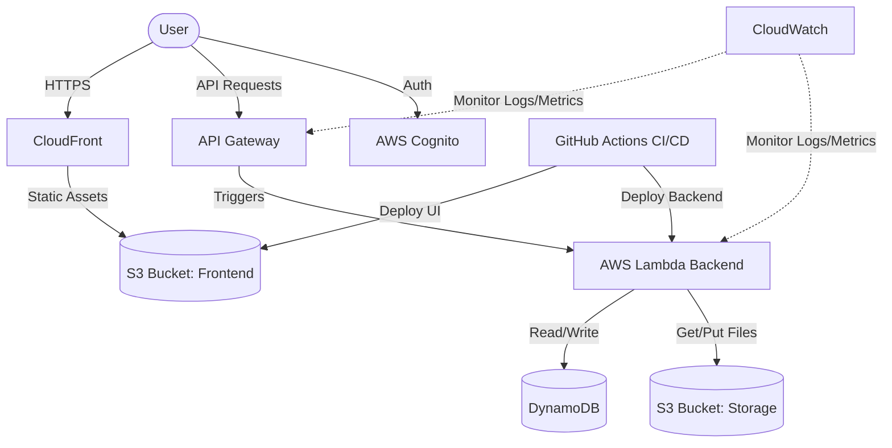

# System Architecture

```mermaid
graph TD
    User([User]) -->|HTTPS| CF[CloudFront]
    CF -->|Static Assets| S3_UI[(S3 Bucket: Frontend)]
    
    User -->|API Requests| API[API Gateway]
    User -->|Auth| Cognito[AWS Cognito]
    
    API -->|Triggers| Lambda[AWS Lambda Backend]
    Lambda -->|Read/Write| DynamoDB[(DynamoDB)]
    Lambda -->|Get/Put Files| S3_Storage[(S3 Bucket: Storage)]
    
    CW[CloudWatch] -.->|Monitor Logs/Metrics| API
    CW -.->|Monitor Logs/Metrics| Lambda
    
    GH[GitHub Actions CI/CD] -->|Deploy UI| S3_UI
    GH -->|Deploy Backend| Lambda
```
